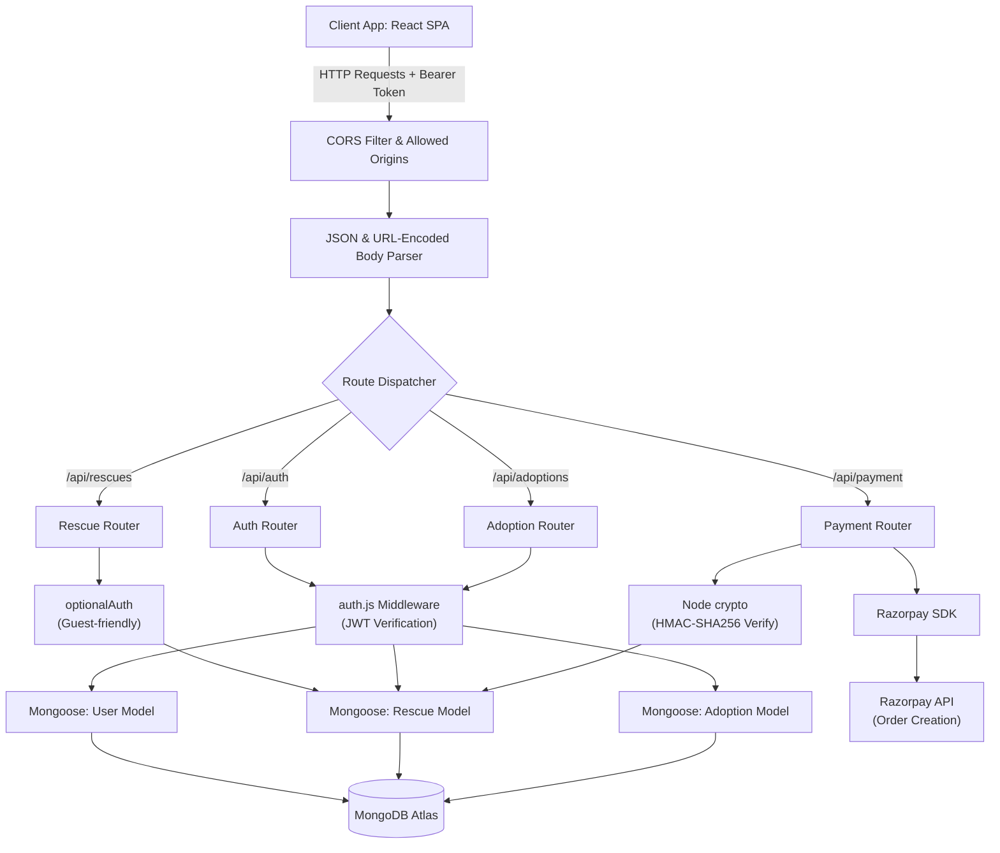

# Animal Rescue Network Backend

A Node.js + Express REST API for the Animal Rescue Network platform. Handles JWT auth, Google OAuth 2.0, rescue case management, adoption application review, and Razorpay payment processing with HMAC-SHA256 signature verification.

**Live Production API Base URL:** [animalresc.onrender.com](https://animalresc.onrender.com)

---

## Tech Stack & Key Integrations

*   **Core Server Framework:** Node.js & Express v5.2.x
*   **Database:** MongoDB Atlas + Mongoose (schema validation, `populate()` relations)
*   **Auth:** JWT via `jsonwebtoken`, bcryptjs for password hashing
*   **Google OAuth:** `google-auth-library` for server-side Google ID token verification
*   **Payments:** Razorpay SDK for order creation; Node.js `crypto` for HMAC-SHA256 signature verification
*   **File Uploads:** Multer for multipart/form-data (photos sent as Base64 in request body)
*   **Config:** dotenv for environment variables
*   **CORS:** Allowlisted frontend origins with `credentials: true`

---

## Architecture & Flow Diagram

The following diagram represents the request-response lifecycle from the client app through middleware layers down to MongoDB and external services:



---

## Project Directory Structure

```text
BACKEND/
├── controllers/              # Reserved for future controller-layer refactoring
│
├── middleware/
│   └── auth.js               # JWT extraction & verification; populates req.user
│
├── models/
│   ├── User.js               # User schema — name, email, password, role, googleId, avatar
│   ├── Rescue.js             # Rescue schema — status pipeline, GPS location, donation tracking
│   └── Adoption.js           # Adoption schema — applicant docs, safety checks, status
│
├── routes/
│   ├── auth.js               # /api/auth — register, login, google, me, role, profile
│   ├── rescues.js            # /api/rescues — CRUD, claim, status update, donate
│   ├── adoptions.js          # /api/adoptions — submit, list, review, approve/reject
│   └── payment.js            # /api/payment — Razorpay create-order & verify signature
│
├── server.js                 # Express entry point — DB connection, route mounting, CORS
├── .env                      # Local environment variables (gitignored)
├── package.json              # Dependencies and start scripts
└── README.md
```

---

## Environment Configuration

To run this backend locally, create a `.env` file in the root of the `BACKEND` directory. On cloud platforms like Render, the `PORT` is dynamically assigned at runtime:

```ini
# MongoDB Connection String (Atlas or local)
MONGO_URI=your_mongodb_atlas_connection_string

# Frontend origin allowed by CORS
FRONTEND_URL=http://localhost:5173

# JWT signing secret
JWT_SECRET=your_jwt_secret_key

# Razorpay credentials
RAZORPAY_KEY_ID=rzp_test_your_key_id
RAZORPAY_KEY_SECRET=your_razorpay_key_secret

# Google OAuth 2.0 Client ID
GOOGLE_CLIENT_ID=your_google_oauth_client_id.apps.googleusercontent.com

# Server port (optional — defaults to 5001)
PORT=5001
```

---

## Database Schemas & Data Models

### 1. User Model (`users`)
Handles authentication and profile management. Saved under `models/User.js`.

| Field | Type | Attributes | Description |
| :--- | :--- | :--- | :--- |
| `name` | String | Required | Full display name of the user |
| `email` | String | Required, Unique | Email address used for authentication |
| `password` | String | Required | bcrypt-hashed password |
| `role` | String | Enum: `user`, `volunteer`, `admin`; Default: `user` | Access control tier |
| `googleId` | String | Default: `null` | Google OAuth `sub` ID for linked accounts |
| `avatar` | String | Default: `null` | Profile picture URL sourced from Google |
| `createdAt` | Date | Auto-generated | Account creation timestamp |

### 2. Rescue Model (`rescues`)
Tracks each animal rescue case through its full status lifecycle. Saved under `models/Rescue.js`.

| Field | Type | Attributes | Description |
| :--- | :--- | :--- | :--- |
| `title` | String | Required | Short descriptive title of the rescue case |
| `description` | String | Required | Full situational description |
| `photoUrl` | String | Default: `""` | Base64 or URL of the uploaded animal photo |
| `location.lat` | Number | — | GPS latitude of the animal's location |
| `location.lng` | Number | — | GPS longitude of the animal's location |
| `location.address` | String | — | Human-readable address |
| `status` | String | Enum (see pipeline) | Current position in the rescue lifecycle |
| `claimedBy` | ObjectId → `User` | Default: `null` | Volunteer who has claimed this rescue |
| `reportedBy` | ObjectId → `User` | Default: `null` | User who filed the rescue report |
| `needsDonation` | Boolean | Default: `false` | Whether this case requires financial aid |
| `donationAmountNeeded` | Number | Default: `0` | Target donation amount in INR |
| `donationAmountRaised` | Number | Default: `0` | Total verified donations received |
| `createdAt` | Date | Auto-generated | Report creation timestamp |

**Rescue Status Pipeline:**
```
Pending → Rescued from Location → Rescued and Treated → Ready for Adoption → Rehomed
```

### 3. Adoption Model (`adoptions`)
Tracks each adoption application from submission through volunteer review to decision. Saved under `models/Adoption.js`.

| Field | Type | Attributes | Description |
| :--- | :--- | :--- | :--- |
| `rescue` | ObjectId → `Rescue` | Required | The rescue case being applied for |
| `applicant` | ObjectId → `User` | Required | The user submitting the application |
| `status` | String | Enum: `Pending`, `Approved`, `Rejected` | Current application decision state |
| `phone` | String | Required | Applicant's contact number |
| `address` | String | Required | Applicant's home address |
| `message` | String | Default: `""` | Personal message to the reviewing volunteer |
| `housePhotos` | [String] | Default: `[]` | Array of house environment photo URLs/Base64 |
| `aadharPhoto` | String | Required | Aadhar card image URL/Base64 (ID proof) |
| `safetyChecks.secureFencing` | Boolean | Default: `false` | Home has secure fencing |
| `safetyChecks.noHazards` | Boolean | Default: `false` | Home is free of hazards |
| `safetyChecks.caretakerCommitted` | Boolean | Default: `false` | A committed caretaker is present |
| `safetyChecks.consentHomeChecks` | Boolean | Default: `false` | Consent to home visit checks |
| `createdAt` | Date | Auto-generated | Application submission timestamp |

---

## API Reference Guide

### Auth Routes (`/api/auth`)

| Method | Endpoint | Access | Body / Parameters | Description |
| :--- | :--- | :--- | :--- | :--- |
| **POST** | `/register` | Public | `{ name, email, password, role }` | Registers a new user; returns JWT + user profile. |
| **POST** | `/login` | Public | `{ email, password }` | Authenticates user; returns JWT + user profile. |
| **POST** | `/google` | Public | `{ credential, role }` | Verifies Google ID token; creates or links account; returns JWT. |
| **GET** | `/me` | Auth | — | Returns the current authenticated user's profile. |
| **PUT** | `/role` | Auth | `{ role }` | Updates user role to `user` or `volunteer`. |
| **PUT** | `/profile` | Auth | `{ name }` | Updates the user's display name. |

### Rescue Routes (`/api/rescues`)

| Method | Endpoint | Access | Body / Parameters | Description |
| :--- | :--- | :--- | :--- | :--- |
| **GET** | `/` | Public | — | Returns all rescue cases, sorted by newest, with populated user refs. |
| **POST** | `/` | Optional Auth | `{ title, description, photoUrl, location, needsDonation, donationAmountNeeded }` | Reports a new rescue case; sets `reportedBy` if token is present. |
| **PUT** | `/:id/claim` | Auth | — | Volunteer claims a rescue; sets `claimedBy` and status to `Rescued from Location`. |
| **PUT** | `/:id/status` | Auth (Volunteer/Admin) | `{ status }` | Updates rescue status; restricted to the claiming volunteer or admin. |
| **PUT** | `/:id/donate` | Public | `{ amount }` | Increments `donationAmountRaised`; called post payment verification. |

### Adoption Routes (`/api/adoptions`)

| Method | Endpoint | Access | Body / Parameters | Description |
| :--- | :--- | :--- | :--- | :--- |
| **POST** | `/` | Auth | `{ rescueId, phone, address, message, aadharPhoto, housePhotos }` | Submits an adoption application; rescue must be `Ready for Adoption`; blocks duplicates. |
| **GET** | `/` | Auth | — | Returns applications filtered by role: user sees own apps; volunteer sees apps for their rescues; admin sees all. |
| **GET** | `/rescue/:rescueId` | Auth (Volunteer/Admin) | — | Returns all applications for a specific rescue; restricted to the claiming volunteer or admin. |
| **PUT** | `/:id/status` | Auth (Volunteer/Admin) | `{ status, safetyChecks }` | Approves or rejects an application; approval requires all 4 safety checks to be `true`. |

### Payment Routes (`/api/payment`)

| Method | Endpoint | Access | Body / Parameters | Description |
| :--- | :--- | :--- | :--- | :--- |
| **POST** | `/create-order` | Public | `{ amount, rescueId }` | Creates a Razorpay order in INR paise; verifies rescue exists; returns `orderId`, `amount`, `currency`, `keyId`. |
| **POST** | `/verify` | Public | `{ razorpay_order_id, razorpay_payment_id, razorpay_signature, rescueId, amount }` | Verifies HMAC-SHA256 signature; on success, updates `donationAmountRaised` on the rescue. |

---

## Middlewares

### 1. JWT Authentication Middleware (`middleware/auth.js`)
Extracts the Bearer token from the `Authorization` header, verifies it against `JWT_SECRET`, and populates `req.user = { id, role }` before passing control to the route handler. Returns `401 Unauthorized` on missing or invalid tokens.

### 2. Optional Auth (inline, `routes/rescues.js`)
A lightweight middleware that reads the Authorization header if present and sets `req.user` without blocking the request if no token exists. Used on `POST /api/rescues` to allow guests to report rescues while associating reports with logged-in users when a token is provided.

### 3. Other Protections
*   **CORS Configuration:** Explicitly allowlists `FRONTEND_URL` and local development origins; blocks all other origins; enables `credentials: true`.
*   **Role Authorization (inline):** Route handlers enforce ownership rules — e.g., only the volunteer whose ID matches `rescue.claimedBy`, or a user with `role === 'admin'`, can update rescue status or approve adoptions.
*   **Adoption Approval Guard:** The `PUT /api/adoptions/:id/status` handler enforces that all four `safetyChecks` fields must be `true` before an `Approved` status is accepted, preventing premature approvals.

---

## Getting Started & Local Setup

### Prerequisites
1.  **Node.js:** v18+ installed.
2.  **Database:** A MongoDB Atlas URI or a locally running MongoDB instance.
3.  **Payment:** Razorpay test account credentials.
4.  **Google Auth:** Google Cloud project with an OAuth 2.0 Web Client ID configured.

### Installation Instructions
1.  Navigate to the `BACKEND` directory and install dependencies:
    ```bash
    npm install
    ```
2.  Configure your environment file (`.env`) matching the structure in the Configuration section above.
3.  Start the server:
    ```bash
    npm run dev
    ```
    The console will show `Server running on port 5001` and `MongoDB connected`.

---

## Deployment

The backend runs on **Render** as a Web Service:

**Live API:** `https://animalresc.onrender.com`

### 1. Dynamic Port Allocation
Do not hardcode the `PORT` on Render. The Express app listens dynamically via `process.env.PORT || 5001`.

### 2. Environment Variables Configuration
Do not commit your `.env` file. Configure these values securely under **Environment Variables** in the Render dashboard:
- `MONGO_URI`
- `JWT_SECRET`
- `RAZORPAY_KEY_ID`, `RAZORPAY_KEY_SECRET`
- `GOOGLE_CLIENT_ID`
- `FRONTEND_URL` *(your live frontend URL)*

---
