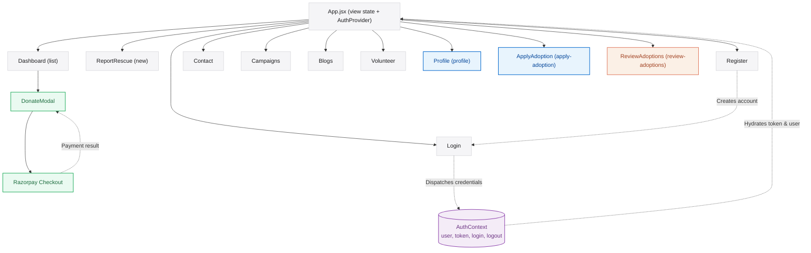

# Animal Rescue Network Client — React 19 Frontend

[](https://react.dev/)
[](https://vite.dev/)
[](https://tailwindcss.com/)
[](https://reactrouter.com/)
[](https://axios-http.com/)

**Live Production Deploy:** [animalresc.onrender.com](https://animalresc.onrender.com)

The frontend for Animal Rescue Network — built with React 19 and Vite 8. Uses a `view` state variable in `App.jsx` for navigation instead of URL routing, React Context for auth, and Axios for all API calls.

---

## Core Architecture Highlights

### 1. View-Based Routing & State Pattern
Rather than URL-based routing, the application uses a centralized `view` state variable in `App.jsx` to conditionally render page components. This eliminates the complexity of a full router setup for this SPA structure while keeping transitions instant and state co-located:
* **Single Source of Navigation:** `setView('apply-adoption')`, `setView('review-adoptions')`, etc., are passed as props down the component tree, allowing any component to trigger a view transition.
* **Selected Entity Forwarding:** `selectedRescue` state is passed alongside `setView` so that pages like `ApplyAdoption` and `ReviewAdoptions` always receive their target rescue context without URL parameters.

### 2. Authentication State & Context (`src/context/AuthContext.jsx`)
Global authentication is managed by React Context:
* **Session Restoration:** On app load, the context checks `localStorage` for a cached token and user object and restores the session before the first render.
* **Logout:** Clears both the in-memory state and `localStorage`.
* **Access:** All components use `useContext(AuthContext)` to get `user`, `token`, `login()`, and `logout()` without prop drilling.

### 3. Role-Aware UI
The Navbar and individual components adapt dynamically based on `user.role`:
* **Guest:** Login and Register links only.
* **User:** Full navigation including Dashboard, Campaigns, Blogs, Volunteer, Contact, and Profile.
* **Volunteer / Admin:** All User links plus Review Adoptions, with additional controls on RescueCards (claim, status update).

### 4. Razorpay Payment Integration
The `DonateModal` component implements a full client-side Razorpay checkout flow:
* Requests a payment order from the backend (`POST /api/payment/create-order`).
* Opens the Razorpay checkout widget with the returned `orderId` and `keyId`.
* On payment success, sends `razorpay_payment_id`, `razorpay_order_id`, and `razorpay_signature` to the backend for HMAC verification before recording the donation.

---

## Client Navigation & State Architecture

This diagram visualizes the application's view structure, auth state synchronization, and role-based rendering:



---

## Project Directory Structure

```text
FRONTEND/
├── public/                       # Static public assets (favicons, etc.)
├── src/
│   ├── assets/                   # Images, SVGs, and static resources
│   │
│   ├── components/               # Reusable UI components
│   │   ├── Navbar.jsx            # Role-aware top navigation bar
│   │   ├── Footer.jsx            # Site footer
│   │   ├── Hero.jsx              # Homepage hero section with CTA
│   │   ├── ServicesSection.jsx   # Platform services overview cards
│   │   ├── RescueCard.jsx        # Individual rescue case card (claim, donate, adopt)
│   │   ├── DonateModal.jsx       # Razorpay donation checkout modal
│   │   ├── AdoptionModal.jsx     # Adoption application confirmation modal
│   │   └── GoogleLoginButton.jsx # Google OAuth 2.0 sign-in button (GSI)
│   │
│   ├── context/
│   │   └── AuthContext.jsx       # Global auth state (user, token, login, logout)
│   │
│   ├── config/
│   │   └── api.js                # Base API URL sourced from VITE_API_URL env variable
│   │
│   ├── pages/
│   │   ├── Dashboard.jsx         # Home — all rescue cases grid
│   │   ├── ReportRescue.jsx      # Report a new rescue (photo + map location)
│   │   ├── ApplyAdoption.jsx     # Adoption application form (ID + house photos)
│   │   ├── ReviewAdoptions.jsx   # Volunteer adoption review & approval dashboard
│   │   ├── Profile.jsx           # User profile + submitted applications tracker
│   │   ├── Login.jsx             # Email/password + Google login
│   │   ├── Register.jsx          # User/Volunteer registration
│   │   ├── Campaigns.jsx         # Animal welfare campaigns page
│   │   ├── Blogs.jsx             # Community blog articles
│   │   ├── Volunteer.jsx         # Volunteer information and sign-up
│   │   └── Contact.jsx           # Contact and inquiry form
│   │
│   ├── App.jsx                   # Root component — view state router & AuthProvider
│   ├── App.css                   # Component-level global styles
│   ├── index.css                 # Tailwind CSS directives and base styles
│   └── main.jsx                  # React DOM entry point
│
├── .env                          # Client environment variables (gitignored)
├── .gitignore
├── eslint.config.js              # ESLint React configuration
├── index.html                    # HTML shell
├── package.json                  # Dependencies and npm scripts
├── tailwind.config.js            # Tailwind CSS configuration
└── vite.config.js                # Vite build and plugin configuration
```

---

## Tech Stack & Key Dependencies

Packages used:
* **React 19.2.6:** Core UI library with hooks.
* **Vite 8.0.12:** Dev server with HMR and Rollup bundling.
* **Tailwind CSS v4.3.0:** Utility-first CSS with the `@tailwindcss/vite` plugin.
* **React Router DOM 7.15.1:** Client-side navigation.
* **Axios 1.16.1:** HTTP client for API calls with auth headers.
* **React Icons 5.6.0 & Heroicons 2.2.0:** Icon sets used across components.
* **Google Identity Services (GSI):** Google Sign-In SDK for OAuth 2.0.

---

## Environment Configuration

To run this application locally, create a `.env` file in the root `FRONTEND` directory. Vite requires all client environment variables to be prefixed with `VITE_` to be compiled into the browser bundle:

```ini
# Base URL of the running backend Express API
VITE_API_URL=http://localhost:5001

# Google OAuth 2.0 Client ID (from Google Cloud Console)
VITE_GOOGLE_CLIENT_ID=your_google_oauth_client_id.apps.googleusercontent.com
```

---

## Local Setup

### 1. Prerequisites
Ensure the following are installed on your operating system:
* **Node.js** (v18.x or v20.x recommended)
* **npm** (v9.x or v10.x)

### 2. Clone and Install Dependencies
```bash
cd FRONTEND
npm install
```

### 3. Run Development Server
```bash
npm run dev
```
Once initialized, the CLI outputs the local network URL (typically `http://localhost:5173`).

### 4. Build for Production
```bash
npm run build
```
Packages the app into optimized, minified static files inside the `/dist` directory, ready for deployment on Vercel, Render, or any static hosting provider.

### 5. Code Quality Linting
```bash
npm run lint
```

---

## API Endpoints Used

All outgoing HTTP calls are made via **Axios** using the base URL from `src/config/api.js`:

```js
// src/config/api.js
const API_URL = import.meta.env.VITE_API_URL || 'http://localhost:5001';
export default API_URL;
```

**Common API Mappings consumed by this client:**
* **Register:** `POST /api/auth/register`
* **Login:** `POST /api/auth/login`
* **Google Auth:** `POST /api/auth/google`
* **Session Restore:** `GET /api/auth/me`
* **Update Profile:** `PUT /api/auth/profile`
* **Fetch Rescues:** `GET /api/rescues`
* **Report Rescue:** `POST /api/rescues`
* **Claim Rescue:** `PUT /api/rescues/:id/claim`
* **Update Rescue Status:** `PUT /api/rescues/:id/status`
* **Submit Adoption:** `POST /api/adoptions`
* **Fetch Adoptions:** `GET /api/adoptions`
* **Review Application:** `PUT /api/adoptions/:id/status`
* **Create Payment Order:** `POST /api/payment/create-order`
* **Verify Payment:** `POST /api/payment/verify`

---

## Production Deployment Guidelines

* **Frontend:** Deploy on **Vercel** or **Render Static Site**.
* **Backend:** Deploy on **Render** as a Web Service.

### Frontend Deployment: Vercel

When importing the repository in Vercel:
* **Root Directory:** Set to `FRONTEND` (React files are nested in the `FRONTEND` folder).
* **Framework Preset:** Select **Vite** (auto-detected).
* **Build Command:** `npm run build`
* **Output Directory:** `dist`

Add the following Environment Variables in your Vercel project settings:
* **Key:** `VITE_API_URL` → **Value:** `https://your-backend-api.onrender.com`
* **Key:** `VITE_GOOGLE_CLIENT_ID` → **Value:** your Google OAuth Client ID

Because React Router manages routing on the client side, configure a **`vercel.json`** in the `FRONTEND` root to prevent 404s on direct URL access:
```json
{
  "rewrites": [
    { "source": "/(.*)", "destination": "/index.html" }
  ]
}
```

---
